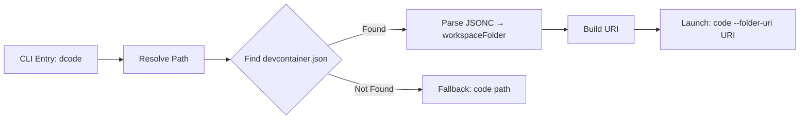

# Plan: dcode CLI

## Problem

Replace the two-step `code .` → "Reopen in Container" workflow with a single `dcode .` command that launches VS Code directly into the devcontainer.

## Approach

A minimal Python CLI packaged as a UV tool. Single module, no abstractions. Uses the verified `vscode-remote://dev-container+<hex>/workspaces/<name>` URI scheme with `code --folder-uri`.

## Assumptions (override if wrong)

- **Fallback**: If no devcontainer found, fall back to plain `code <path>` (don't error)
- **Paths**: Support `dcode .`, `dcode /some/path`, `dcode` (defaults to `.`)
- **Insiders**: Use `--insiders` / `-i` flag rather than a separate `dcode-insiders` command
- **No dry-run needed**: Just launch it

## Architecture



## File Structure

```
dcode/
├── pyproject.toml          # Package metadata, entry point, dependencies
├── src/
│   └── dcode/
│       ├── __init__.py     # Version only
│       └── cli.py          # Everything lives here (~80 lines)
├── tests/
│   └── test_cli.py         # Unit tests for URI building + devcontainer finding
├── README.md               # Install + usage
└── LICENSE                  # MIT
```

**3 new files of substance** (cli.py, test_cli.py, pyproject.toml). README/LICENSE/init are boilerplate.

## pyproject.toml

```toml
[project]
name = "dcode"
version = "0.1.0"
description = "Open folders in VS Code devcontainers from the CLI"
requires-python = ">=3.11"
dependencies = ["json5"]

[project.scripts]
dcode = "dcode.cli:main"

[build-system]
requires = ["hatchling"]
build-backend = "hatchling.build"

[tool.hatch.build.targets.wheel]
packages = ["src/dcode"]
```

Install: `uv tool install git+https://github.com/rosstaco/dcode`

## cli.py — Core Logic

### 1. Find devcontainer.json

Search order (first match wins):
1. `<path>/.devcontainer/devcontainer.json`
2. `<path>/.devcontainer.json`

### 2. Parse workspaceFolder

```python
import json5

def get_workspace_folder(devcontainer_path: Path, target_path: Path) -> str:
    config = json5.load(devcontainer_path.open())
    return config.get("workspaceFolder", f"/workspaces/{target_path.name}")
```

### 3. Build URI

```python
def build_uri(host_path: str, workspace_folder: str) -> str:
    hex_path = host_path.encode().hex()
    return f"vscode-remote://dev-container+{hex_path}{workspace_folder}"
```

Verified formula from research: `vscode-remote://dev-container+<hex>/workspaces/<name>`

### 4. Launch

```python
import subprocess

def launch(editor: str, uri: str) -> None:
    subprocess.run([editor, "--folder-uri", uri])
```

Where `editor` is `code` or `code-insiders`.

### 5. CLI Entry Point

```
dcode [PATH] [--insiders/-i]
```

- `PATH` defaults to `.` (current directory)
- `--insiders` / `-i` uses `code-insiders` instead of `code`
- No external CLI framework — just `argparse` (stdlib, no extra dependency)

## Implementation Order

1. `pyproject.toml` — package definition with entry point
2. `src/dcode/__init__.py` — version string
3. `src/dcode/cli.py` — all logic (~80 lines)
4. `tests/test_cli.py` — unit tests
5. `README.md` — install and usage docs
6. `LICENSE` — MIT

## Test Cases

### Test 1: Build URI from path
```
Given: host_path = "/home/ross/repos/myapp"
       workspace_folder = "/workspaces/myapp"
When:  build_uri(host_path, workspace_folder)
Then:  "vscode-remote://dev-container+2f686f6d652f726f73732f7265706f732f6d79617070/workspaces/myapp"
Data:  hex verified: "/home/ross/repos/myapp".encode().hex() == "2f686f6d652f726f73732f7265706f732f6d79617070"
```

### Test 2: Find devcontainer.json in .devcontainer/
```
Given: tmp dir with .devcontainer/devcontainer.json containing {"name": "test"}
When:  find_devcontainer(tmp_path)
Then:  returns Path to .devcontainer/devcontainer.json
```

### Test 3: Find devcontainer.json at root level
```
Given: tmp dir with .devcontainer.json at root
When:  find_devcontainer(tmp_path)
Then:  returns Path to .devcontainer.json
```

### Test 4: No devcontainer found
```
Given: tmp dir with no devcontainer config
When:  find_devcontainer(tmp_path)
Then:  returns None
```

### Test 5: Parse workspaceFolder from config
```
Given: devcontainer.json with {"workspaceFolder": "/workspace"}
When:  get_workspace_folder(config_path, Path("/home/ross/project"))
Then:  returns "/workspace"
```

### Test 6: Default workspaceFolder when not set
```
Given: devcontainer.json with {"name": "test"} (no workspaceFolder)
When:  get_workspace_folder(config_path, Path("/home/ross/project"))
Then:  returns "/workspaces/project"
```

### Test 7: Parse JSONC with comments and trailing commas
```
Given: devcontainer.json containing:
       // This is a comment
       {
         "name": "test",
         "workspaceFolder": "/custom",
       }
When:  get_workspace_folder(config_path, Path("/any"))
Then:  returns "/custom"
```

### Test 8: Launch calls correct editor
```
Given: --insiders flag is set
When:  main() runs
Then:  subprocess.run called with ["code-insiders", "--folder-uri", <uri>]
```

### Test 9: Fallback when no devcontainer
```
Given: path with no devcontainer.json
When:  main() runs with that path
Then:  subprocess.run called with ["code", <path>] (plain open, no URI)
```

## Acceptance Criteria

- [ ] `uv tool install .` from repo root works
- [ ] `dcode .` in a folder with `.devcontainer/devcontainer.json` launches VS Code in devcontainer
- [ ] `dcode .` in a folder WITHOUT devcontainer falls back to `code .`
- [ ] `dcode --insiders .` uses `code-insiders`
- [ ] `dcode /absolute/path` works with absolute paths
- [ ] `dcode` with no args defaults to current directory
- [ ] Custom `workspaceFolder` in devcontainer.json is respected
- [ ] JSONC comments/trailing commas in devcontainer.json don't break parsing
- [ ] Works on macOS (tested manually)
- [ ] All unit tests pass
- [ ] `uv tool install git+https://github.com/rosstaco/dcode` works after push

## Risks

1. **`--folder-uri` is undocumented** — could break in future VS Code updates. Mitigation: it's been stable for years and the devcontainer extension uses it internally.
2. **WSL path encoding** — not tested during research. The script uses `str(path.resolve())` which should give the Linux path inside WSL. Low risk since `code` from WSL already handles the Windows↔Linux bridge.
