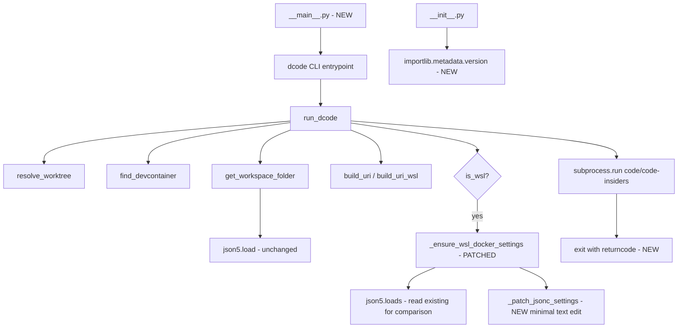

# Plan: dcode audit cleanup

Date: 2026-04-27
Source: audit raised in chat (no separate research-findings.md — audit IS the research, all findings reference current source files).

## Goals

Address the audit findings the user accepted, without changing the CLI's user-facing behavior or URI format.

## Out of scope

- Lowering `requires-python` to 3.10
- Removing `copilot-session-*.md`
- Refactoring `run_dcode()` control flow beyond what bug fixes require
- Adding logging module / `_log()` helper
- **Dropping `json5` dependency** — deferred; risk of JSONC edge cases outweighs the benefit. Keep `json5` for parsing both `devcontainer.json` and existing `settings.json`.

## Architecture



## File list (in order)

1. **`pyproject.toml`** — add `[project.urls]`; keep `json5` dep; switch to `hatch-vcs` for git-tag-based versioning (replaces static `version = "0.4.1"` with dynamic). Add `hatch-vcs` to `[build-system].requires` and configure `[tool.hatch.version] source = "vcs"`.
2. **`src/dcode/__init__.py`** — replace hardcoded `__version__` with `importlib.metadata.version("dcode")` (with `PackageNotFoundError` fallback to `"0.0.0+unknown"`).
2a. **`.github/copilot-instructions.md`** — remove the line saying "version must be bumped in both `pyproject.toml` and `src/dcode/__init__.py`" since both are now auto-derived from git tags.
2b. **Pre-merge action** — ensure tag `v0.4.1` exists on the current commit before merging this change, so `uv tool install git+https://...` from `main` continues to resolve a clean version.
3. **`src/dcode/cli.py`** — apply the fixes below (see "Code changes").
4. **`src/dcode/__main__.py`** *(NEW)* — `from .cli import main; main()`.
5. **`tests/test_cli.py`** — add new test cases (see "Test cases"). `json5` imports stay.
6. **`ruff.toml`** *(NEW)* — minimal ruff config (line-length 100, target-version py311, select E, F, I, UP, B, SIM).
7. **`.github/workflows/ci.yml`** *(NEW)* — matrix py3.11/3.12/3.13: `uv sync`, `uv run ruff check`, `uv run pytest`. Use `actions/checkout@v4` with `fetch-depth: 0` so `hatch-vcs` can run `git describe`.
8. **`.github/workflows/release-please.yml`** *(NEW)* — [googleapis/release-please-action](https://github.com/googleapis/release-please-action) configured for `release-type: python`. Watches `main`, parses Conventional Commits, opens a release PR with version bump + changelog. When merged, creates tag `vX.Y.Z` and GitHub Release. `hatch-vcs` then picks up the tag for the actual package version.
9. **`.release-please-manifest.json`** *(NEW)* — `{".": "0.4.1"}` so release-please knows the current baseline.
10. **`release-please-config.json`** *(NEW)* — minimal config: `{"packages": {".": {"release-type": "python", "bump-minor-pre-major": true}}}`. Note: release-please's `python` type normally edits `pyproject.toml` and `__init__.py` — we configure `extra-files: []` and rely solely on the git tag (since hatch-vcs reads the tag, not the file). Alternative: use `release-type: simple` which only manages the tag and changelog.
11. **`README.md`** — add a "WSL behavior" subsection documenting the auto-edit of `settings.json`.
12. **`CHANGELOG.md`** *(NEW, empty/seeded)* — release-please appends to this on each release.

## Code changes (cli.py)

### Fix 1 — `_ensure_wsl_docker_settings` distro skip bug
Current logic returns early if `executeInWSL` is `True`, never setting `executeInWSLDistro`. Change to:
- Compute desired patches: `executeInWSL=True` always; `executeInWSLDistro=<distro>` if distro known.
- Compare against existing settings (parsed via `json5.loads`); only write if at least one patch differs.

### Fix 2 — JSONC preservation (minimal text edit)
Replace the `json.dumps(settings, indent=4)` rewrite with `_patch_jsonc_settings(text: str, patches: dict) -> str | None`:
- For each `key, value` patch: if a top-level `"key":` already exists, regex-replace its value in place (bool/string values only).
- Otherwise insert the new `"key": value,` line just before the final closing top-level `}`.
- Preserves comments, trailing commas, indentation style.
- If the file isn't a recognizable top-level object (regex doesn't match, e.g. exotic formatting), return `None` and fall back to printing the hint instead of corrupting the file.

### Fix 3 — JSONC error handling in `get_workspace_folder`
Wrap `json5.load` in try/except `(OSError, ValueError)`; on failure print a friendly stderr message and fall back to default `/workspaces/{target.name}`.

### Fix 4 — subprocess return code propagation
In `run_dcode`, capture `result = subprocess.run([...], check=False)` and `sys.exit(result.returncode)` if non-zero. (Only for the `code` invocation, not for `wslpath`.)

### Fix 5 — narrow exception in `_ensure_wsl_docker_settings` settings parse
Replace `except Exception` with `except (OSError, ValueError)`.

### Fix 6 — `_wsl_to_windows_path` returncode check
Check `result.returncode == 0` before using stdout.

### Fix 7 — small lint cleanups
- Collapse `f"dcode: configured ..." + (f" ({distro})" if distro else "")` into a single conditional f-string with no leading `f` on the static part.
- `is_wsl()` — move `read_text` inside the existence branch cleanly.

## Dependency removal (json5 → stdlib JSONC)

Replace both call sites:
- `get_workspace_folder`: `json5.load(f)` → `_load_jsonc(f.read())`
- `_ensure_wsl_docker_settings`: `json5.loads(text)` → `_load_jsonc(text)` (read for comparison only; writes go through `_patch_jsonc_settings`)

JSONC loader spec:
```
def _load_jsonc(text: str) -> dict:
    # 1. Walk char-by-char tracking string state (handle \" escape)
    # 2. Outside strings: drop //... to end-of-line, drop /* ... */
    # 3. Drop trailing commas before } or ]
    # 4. json.loads the result
```

## Test cases

### test_cli.py — new cases

```
Test: ensure_wsl_docker_settings sets distro when executeInWSL already true but distro missing
Given: settings.json containing only {"dev.containers.executeInWSL": true}
When:  _ensure_wsl_docker_settings() with get_wsl_distro="Ubuntu"
Then:  file now also contains "dev.containers.executeInWSLDistro": "Ubuntu"
Data:  '{"dev.containers.executeInWSL": true}'

Test: ensure_wsl_docker_settings preserves JSONC comments and trailing commas
Given: settings.json containing comments + trailing commas
When:  _ensure_wsl_docker_settings() with distro="Ubuntu"
Then:  resulting text still contains the original "// my comment" line and trailing comma
Data:  '// keep me\n{\n  "editor.fontSize": 14,\n}\n'

Test: ensure_wsl_docker_settings does nothing when both keys already correct
Given: settings.json with both keys set to expected values
When:  _ensure_wsl_docker_settings() with distro="Ubuntu"
Then:  file mtime unchanged (or content byte-identical)

Test: get_workspace_folder falls back on malformed devcontainer.json
Given: devcontainer.json containing "{ this is not json"
When:  get_workspace_folder(path, Path("/x/myapp"))
Then:  returns "/workspaces/myapp" and prints a warning to stderr

Test: run_dcode propagates non-zero exit from code launcher
Given: subprocess.run patched to return CompletedProcess(returncode=2)
When:  run_dcode(tmp_path)
Then:  SystemExit raised with code 2

Test: __version__ resolves via importlib.metadata
Given: package installed
When:  import dcode; dcode.__version__
Then:  matches version from importlib.metadata.version("dcode")
```

### Existing tests
- `test_handles_jsonc_comments_and_trailing_commas` — unchanged (still uses `json5`).
- `test_skips_when_already_configured` — **rename** to `test_adds_missing_distro_when_executeInWSL_already_true` with inverted assertion (the bug being fixed: distro must now be added).

### New test
```
Test: ensure_wsl_docker_settings falls back to hint on un-patchable file
Given: settings.json containing only "[]" (not an object)
When:  _ensure_wsl_docker_settings() with distro="Ubuntu"
Then:  file unchanged, hint printed to stderr
```

## Acceptance criteria

- [ ] `uv run pytest` passes (all old + new tests)
- [ ] `uv run ruff check` passes clean
- [ ] `python -m dcode --help` works
- [ ] No version mismatch possible — version is auto-resolved from git tags via `hatch-vcs` and exposed through `importlib.metadata`
- [ ] `uv tool install git+https://github.com/rosstaco/dcode` succeeds and `python -c 'import dcode; print(dcode.__version__)'` shows the tag-derived version
- [ ] Tag `v0.4.1` exists on `main` before merging this change
- [ ] `.github/copilot-instructions.md` no longer references manual version bumping
- [ ] release-please workflow opens a release PR after the first Conventional Commit lands on `main` post-merge
- [ ] Merging the release PR creates tag `vX.Y.Z` and a GitHub Release
- [ ] `uv tool install git+https://github.com/rosstaco/dcode` after that release returns the new version via `dcode.__version__`
- [ ] `_ensure_wsl_docker_settings` no longer rewrites a JSONC settings file as plain JSON (verified via test reading raw text, comments preserved)
- [ ] `_ensure_wsl_docker_settings` falls back to printing the hint (not corrupting the file) when the settings file has un-patchable structure
- [ ] `_ensure_wsl_docker_settings` correctly adds `executeInWSLDistro` even when `executeInWSL` is already `true`
- [ ] Malformed `devcontainer.json` produces a friendly stderr message instead of a stack trace
- [ ] Non-zero exit from `code`/`code-insiders` is propagated as the dcode exit code
- [ ] `pyproject.toml` has `[project.urls]` with Homepage, Issues, Source pointing at `https://github.com/rosstaco/dcode`
- [ ] `.github/workflows/ci.yml` runs ruff + pytest on py3.11/3.12/3.13
- [ ] README has a "WSL behavior" section documenting the `settings.json` auto-edit and how to opt out (delete the keys / pre-set them)
- [ ] Manual smoke test on macOS: `dcode .` in this repo (no devcontainer present) falls through to `code .`; `dcode <some-devcontainer-repo>` opens the URI form
- [ ] Manual smoke test on WSL (if available): JSONC `settings.json` is patched without losing comments

## Risks & assumptions

1. **Top-level-key regex patch** — assumes `settings.json` is one top-level object (VS Code always writes it this way). Hand-crafted exotic formatting is handled by the un-patchable-fallback path (prints hint, leaves file alone). Tested.

2. **`importlib.metadata` in editable installs** — `uv tool install` and `pip install -e .` both register metadata. Bare `python src/dcode/cli.py` would fail, but that's not a supported entrypoint.

3. **`hatch-vcs` requires git history at build time** — `uv tool install git+https://...` clones with refs/tags, so `git describe` works. Risk: if no tags exist in the repo, build fails. Mitigation: tag `v0.4.1` on current `main` *before* merging this change. Untagged commits resolve to `0.4.1.devN+g<sha>` which is fine.

4. **CI checkout depth** — `actions/checkout@v4` defaults to shallow (depth=1), which breaks `git describe`. CI workflow must set `fetch-depth: 0` (or `fetch-tags: true`).

5. **CI matrix py3.13 availability** — `actions/setup-python@v5` supports it; uv supports it.

6. **No `code` CLI on CI** — `subprocess.run` is mocked in tests, so CI doesn't need VS Code installed. Manual smoke tests cover the real launch.

## Implementation order

Suggested commit grouping:
1. WSL settings fixes (distro bug + JSONC-preserving patcher + tests)
2. devcontainer.json error handling + subprocess returncode propagation + tests
3. Switch to `hatch-vcs` + version single-sourcing via `importlib.metadata` + `__main__.py` + update copilot-instructions
4. `pyproject.toml` `[project.urls]`
5. ruff config + lint fixes
6. CI workflow (with `fetch-depth: 0`)
7. README WSL section
8. release-please workflow + config + manifest + seed CHANGELOG.md

**Before tagging a release:** `git tag v0.4.1 <current-main-sha> && git push --tags` so existing install method keeps working and release-please has a baseline.

**Conventional Commits requirement:** Once release-please is in place, commits to `main` must use Conventional Commit prefixes (`feat:`, `fix:`, `chore:`, `docs:`, etc.) for the version bumping to work correctly. Add a one-line note to `README.md` (or `CONTRIBUTING.md` if created) about this.
